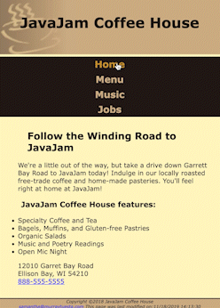

# JavaJam
Promotional website for fictional coffee house developed as part of introductory course to web design.

    

<!-- TABLE OF CONTENTS -->

  
Table of Contents

  <ol>
    <li><a href="#Overview">Overview</a></li>
    <li>
      <a href="#Implementation">Implementation</a>
      <ul>
        <li><a href="#Desktop">Desktop</a></li>
        <li><a href="#Tablet">Tablet</a></li>
        <li><a href="#Phone">Phone</a></li>
      </ul>
    </li>
    <li><a href="#Thank-You">Thank You!</a></li>
  </ol>

## Overview
Developed a promotional website for JavaJam–a fictional coffee house providing food, music, and jobs to their community. To learn more about their menu, live performance schedule, and job application process visit their website:

http://myweb.students.wwu.edu/~murray39/CS102/oliver/Lab8/index.html

## Implementation
The site consists of four HTML5 pages developed from scratch and styled using CSS3. Each page contains a navigational bar (location dependent on screen size) that directs you to any and all pages of the website. Media is encoded into the music page using HTML5 audio controls that allow for the audio to play throughout the page. The job application is a basic form encoded in HTML5. The date of last access to the site is displayed on the home page using JavaScript. 

### Desktop
The desktop version of the JavaJam website developed for screen sizes above 1024px. The navigational bar is located to the left of the page for easy navigation.

### Tablet
The tablet version of the JavaJam website developed for screen sizes max-width 1024px. The navigational bar is now moved to the top of the screen for tablet users and is displayed inline-block. This is achieved through the use of a CSS3 media query which specifies different styling according to screen size.

### Phone
The phone version of the JavaJam website developed for screen sizes max-width 768px. The navigational bar remains at the top for this implementation and is instead in a list format that drops from the top down.

## Thank You!
Thank you for visiting JavaJam!
